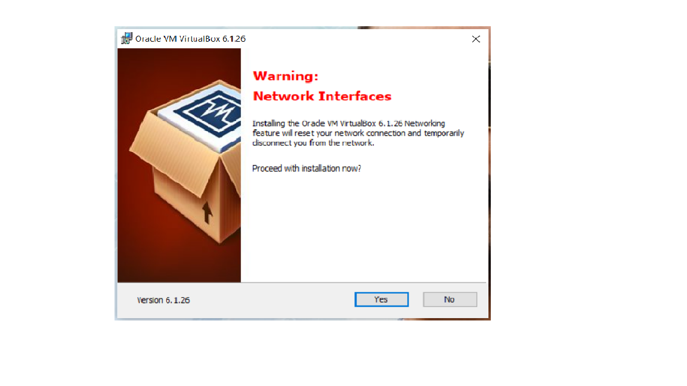
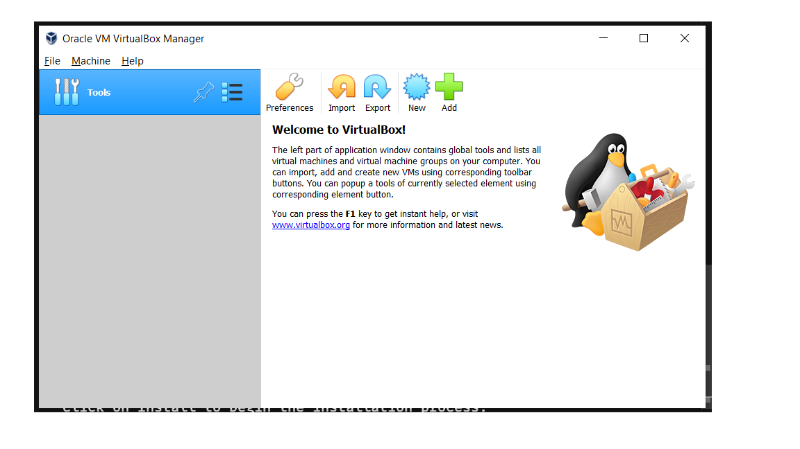
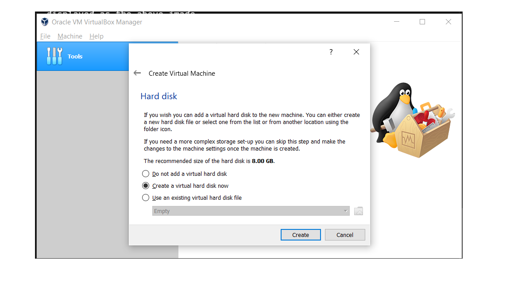
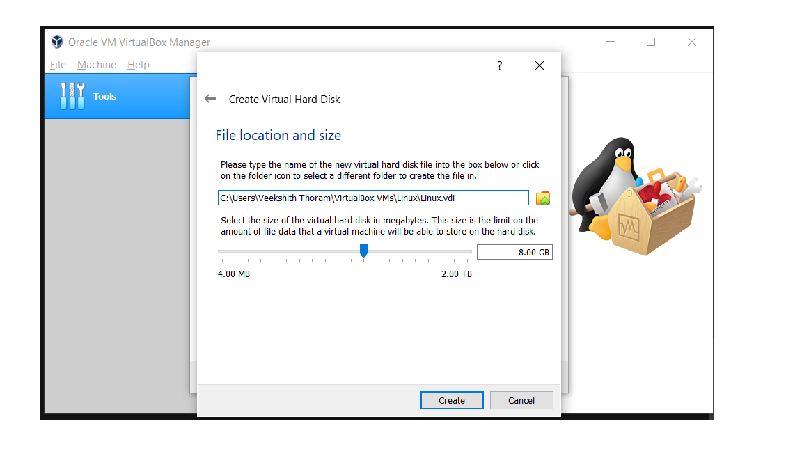

Being a typical engineering student, going cracy for cyber security and ethical hacking is a bit of fantasy for many. So here you are going to exploit various up and down factors in the process of learning.

Here are the two major things which we discuss:

    >Why Linux?

    >Installing Linux in your Windows Environment

## Why Linux?

In most Ethical Hacking and Pentesting tools are designed for **linux**,**unix** environment to work in combination with terminals.
Windows is not a best option of OS to perform these kind of activities because it is **harder to get anonymous** in Windows.

Since most of us are familiarized with Windows OS right from childhood, you might be doubtful whether to get into the fantasy or not.

No problem, I have exquisite solutions to this typical fantasy doubts of yours..

    >1.Multiple OS Booting
    >2.VirtualBox

Yup the above two are an effective way where you can make up stuff as you like.

### 1.Multiple OS Booting

> This technique is quite a bit difficult if you know the basics of operating system and booting OS. Booting is simply installing an OS into your PC or Laptop. Whereas Multiple Booting refers to Installing Multiple OS softwares into your device.
>
> The best option which i suggest is to initially boot your device with Linux distribution of your choice because Linux OS boot partition is more efficient compared to that of Windows. So by doing it like this way, there is more data security and more chances of data recovery.
>
> If you already have a Windows OS running in your device, then also you can boot it with Linux but there is a chance that if the booting process is interrupted in between, the data stored previously may be dislocated. So here we have an alternative to still install **Linux into your Windows** which is our Main Interest here.

### 2.VirtualBox

VirtualBox is a cross-platform visualization software. In simple terms, it is an application which allows you to run multiple OS softwares. So this VirtualBox allows you to install Linux in your Windows OS run device. Not only in Windows, you can install VirtualBox in any operating system and configure according to your requirement.

So basically here are the steps to install VirtualBox:

- Go to the official website of VirtualBox which is [here](https://www.virtualbox.org/wiki/Downloads "VirtualBox").
- Click on the suitable link according to your requirement and the download process starts.
- After the completion of download, click on the downloaded file and wait for the initialiation wizard pops up.
- So go ahead and click next and the default setup is enough.
- A warning appears which basically means that network connection will be reset,no worries just your internet connection breaks and again comes up online.
  

- Click on Install to begin the installation process.
- After the installation process is done,click on **Finish**

So yup, your virtualbox is fully configured and is ready to operate.

## Installing Linux in your Windows Environment

So by now you are completely set up with the VBox software which is displayed as the above image.

Steps to follow to install Linux Distros:

- Click on New tab which is on the top of the panel.
- A window pops up asking the name and file location, give a name and select the file location where you want to store the data of that distros.
- Select the type of Operating System you would like to install,in our case it is Linux, so select Linux.
- Now select the version of Distro you would like to install
  > A distro is basically a distributed operating system. There are different kinds of Linux Distro like Fedora,Debian,RedHat,Kali,etc..
- Now you need to select the Memory Size(RAM) which similarly looks like this,

You can select according to your requirement.

- Now Hard Disk Management, where it asks whether to create or add existing virtual harddisk which is similar like below👇👇

Select an option and click on Create.

- Then select the hard disk file type from VDI,VHD,VMDK according to your requirement and click on Next.
- Now it asks whether the hard disk should be dynamically stored or of fixed size. Select according to your ROM space available.
- Now it asks for the file location of the virtual hard disk and the amount of memory space you want to allocate to it.
  

Select the amount of space you want to allocate and click on create.

So thats it, you have installed your desired Linux Distro into your Windows Device. You can add more OS by following the above installation process into a single VBox.

After the completion of installation your VBox window looks similar to this👇👇

So that's it folks, lets meet next time with another interesting topic to surf over.
